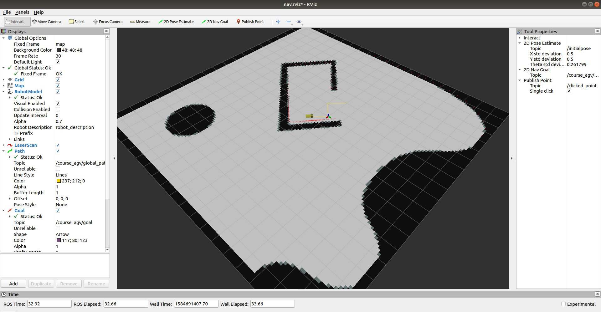
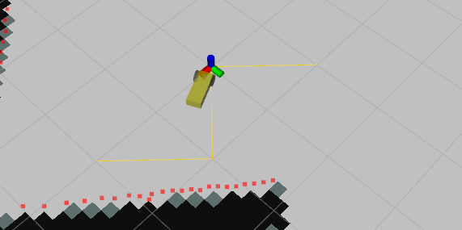
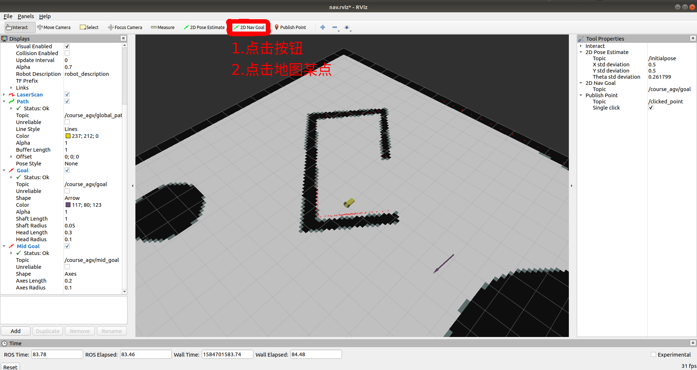

# pathplan

> 通过call map_server的service来获取全局地图信息
>
> 通过tf获取当前机器人坐标
>
> 通过订阅消息获取rviz上设置的goal
>
> 路径规划并发布path

本节推荐工程结构

```bash
src
├──course_agv_gazebo
├──course_agv_description
├──course_agv_control
└──course_agv_nav
    ├── CMakeLists.txt
    ├── launch
    │   ├── nav.launch
    │   └── nav.rviz
    ├── package.xml
    ├── scripts
    │   ├── global_planner.py # 文件已存在
    │   ├── your_own_planner.py # 自己创建
    │   └── stupid_tracking.py # 文件已存在
    └── srv
        └── Plan.srv # use for global planner
```

运行course_agv_nav/nav.launch查看效果:





---

* 如何设置goal




