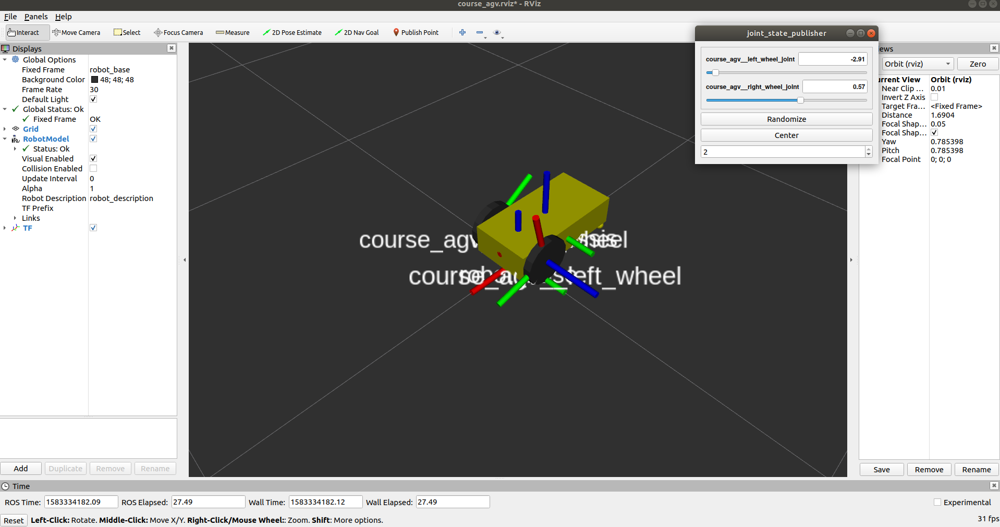
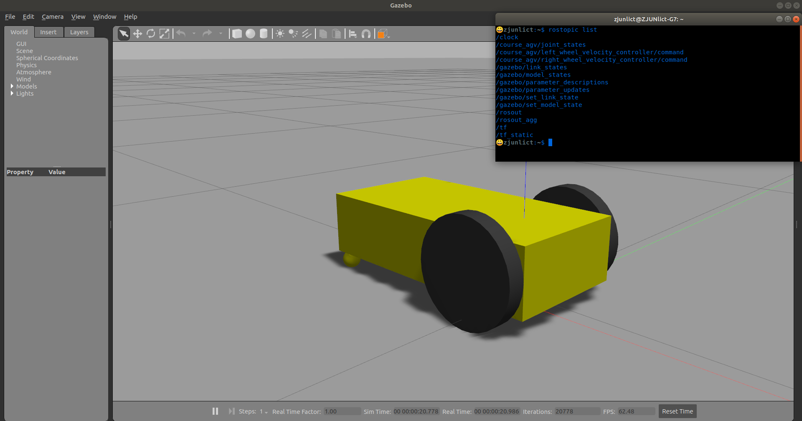
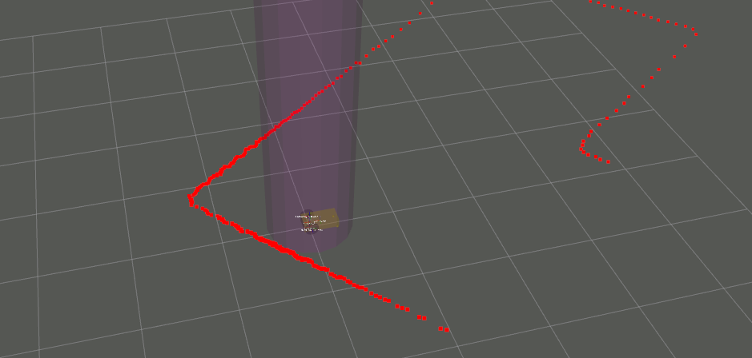

# URDF, joint control and gazebo
# tf, sensors and rviz

>  目标：
>
>  1.编写运动学分解脚本，使机器人可以按照键盘输入速度正确移动
>
>  2.编写robot_tf.py脚本，用于发布robot_base->map的tf，键盘控制在rviz中确认

```bash
apt-get install ros-melodic-joint-state-publisher-gui ros-melodic-joint-state-controller ros-melodic-controller-manager ros-melodic-gazebo-ros-pkgs ros-melodic-gazebo-ros-control ros-melodic-velocity-controllers ros-melodic-map-server
apt-get install xterm
pip install pynput
```

本节推荐package以及细节文件结构请参考task/c9-10

```bash
src
├── course_agv_control
│   ├── CMakeLists.txt
│   ├── config
│   │   └── course_agv_control.yaml
│   ├── launch
│   │   └── course_agv_control.launch
│   ├── scripts
│   │   ├── keyboard_command.py  # 键盘控制
│   │   └── kinematics.py        # 运动学分解 TODO1
│   └── package.xml
├── course_agv_description
│   ├── CMakeLists.txt
│   ├── launch
│   │   ├── course_agv.rviz
│   │   └── course_agv_rviz.launch
│   ├── package.xml
│   └── urdf
│       ├── course_agv.gazebo
│       ├── course_agv.xacro
│       └── materials.xacro
└── course_agv_gazebo
    ├── CMakeLists.txt
    ├── config
    │   ├── map -> ../models/ground_plane_for_agv/map
    │   └── map.yaml
    ├── launch
    │   ├── course_agv_world.launch
    │   ├── course_agv.rviz
    │   └── course_agv_world_rviz.launch
    ├── models
    │   └── ground_plane_for_agv
    │       ├── map
    │       └── ...
    ├── package.xml
    ├── scripts
    │   └── robot_tf.py # TODO2 publish tf:(robot_base->map)
    └── worlds
        └── course_agv.world
```

## 在rviz上检查你的机器人模型

* Universal Robotic Description Format (urdf)
  * link : collision & visual
  * joint : type & limits
* urdf & xacro
  * `gazebo` tag in xacro
  * `transmission` tag in xacro
* node robot_state_publisher : **`tf`**
* node joint_state_publisher

> 运行以下命令查看效果
> `roslaunch course_agv_description course_agv_rviz.launch`




## 在gazebo中运行，并添加controller

* gazebo args
* node : gazebo_ros spawn_model

> 运行以下命令查看效果
> `roslaunch course_agv_gazebo course_agv_world.launch`



## 编写运动学分解程序并下发速度

* `local_velocity` to `wheel velocity`


## 添加地图和传感器

* 在urdf里添加相关link以及joint
* 在.gazebo文件中添加对应插件

>  运行以下命令
> `roslaunch course_agv_gazebo course_agv_world.launch` 


## TF


```
static_transform_publisher x y z qx qy qz qw frame_id child_frame_id  period_in_ms
```

## rviz

* 在rviz中添加需要显示的信息(laser,imu,map)



* 在launch文件中添加tf_publisher，tf tree参考:

```
map
└── robot_base
    ├── course_agv__hokuyo__link
    ├── course_agv__imu
    ├── course_agv__left_wheel
    ├── course_agv__right_wheel
    └── robot_chassis
```

* 此时唯一没有解决的是`map->robot_base`
  * 通过topic:/gazebo/link_states or /gazebo/model_states可以获取agv的全局位置以及姿态
  * 订阅并转换为我们需要的tf广播出去(robot_tf.py)


**可以使用键盘控制查看tf以及其他信息显示是否正确**

---

gazebo : gazebo + gzclient + gzserver

---
urdf工具：

- xmllint
- check_urdf

参考：

1.[Using roslaunch to start Gazebo, world files and URDF models](http://gazebosim.org/tutorials?tut=ros_roslaunch&cat=connect_ros)

2.[Using a URDF in Gazebo](http://gazebosim.org/tutorials/?tut=ros_urdf)

3.[ROS Control in Gazebo](http://gazebosim.org/tutorials/?tut=ros_control)

4.[Building a Visual Robot Model with URDF from Scratch](http://wiki.ros.org/urdf/Tutorials/Building%20a%20Visual%20Robot%20Model%20with%20URDF%20from%20Scratch)

5.[rrbot gazebo demo](https://github.com/ros-simulation/gazebo_ros_demos)

6.[ROS TF](http://wiki.ros.org/tf)

7.[rospy tf broadcast](http://wiki.ros.org/tf/Tutorials/Writing%20a%20tf%20broadcaster%20%28Python%29)